# nyárai andris | 12.weeks.of.greenfox

## Fractals of the Hausdorff dimension

Description:

> basic exercises with recursion as a motor for drawing on canvas

Cantor set | Tree | Koch Snowflake
-----------|------|---------------
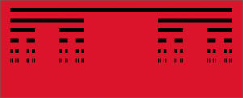 | 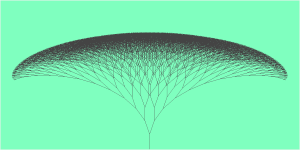 | 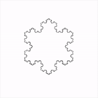

H-tree | Circles | Hexa | Grid
-------|---------|------|-----
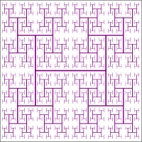 | 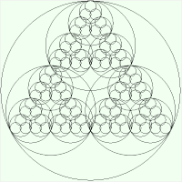 | 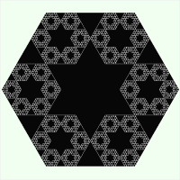 | 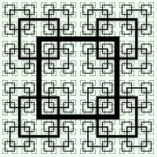

Vicsek | Sierpinski Triangle | Koch Line | Sierpinski Carpet 
-------|---------------------|-----------|------------------
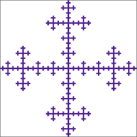 | 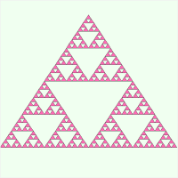 | 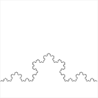 | 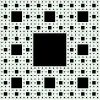

