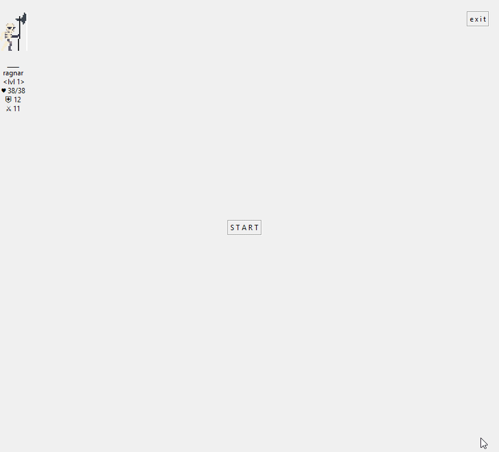

# _13.weeks.of.greenfox_

## Fractals of the Hausdorff dimension

Description:

> using recursion for drawing on the canvas

> [source code](https://github.com/greenfox-academy/andrasnyarai/tree/master/week-03/day05)

Cantor set | Tree | Koch Snowflake
-----------|------|---------------
 |  | 

H-tree | Circles | Hexa | Grid
-------|---------|------|-----
 |  |  | 

Vicsek | Sierpinski Triangle | Koch Line | Sierpinski Carpet 
-------|---------------------|-----------|------------------
 |  |  | 

___

## Maze generating algorithm

Description:

> recursive backtracking for drawing the 'path' of the maze

> each time gives different output.

> [source code](https://github.com/greenfox-academy/andrasnyarai/blob/master/maze_generator.py)

___

## RPG

Description:

> A simple hack/slash game using tkinter

> leveling-up, random-map generation

> beating a level requires killing the boss and acquiring the key

> if your character is on the same tile as an enemy you loose some hp

> thanks for itch.io for the free game assets (a few were modified via gimp)

> [source code](https://github.com/greenfox-academy/andrasnyarai/tree/master/week-05)

___

## Conway's game of life

Description:

> infinite map

> added some drawing functionality

> [source code](https://github.com/greenfox-academy/andrasnyarai/tree/master/game_of_life)

___

## Gallery

Description:

> scrollable

> responsive

> abstract

> [source code](https://github.com/greenfox-academy/andrasnyarai/tree/master/week-07/gallery)

___

## Reddit-like webpage

Decription:

> mocking reddit layout

> submitting & editing posts

> talking to db

> very basic login for users (no salted ssh)

> [source code](https://github.com/greenfox-academy/andrasnyarai/tree/master/week-09/reddit_backend)

 | 

___

## music player

Description:

> insert all music files paths into db

> load all metadata into the interface

> talk with last.fm api

> visualisation via p5.js - rerouting audiocontext to fft's analyserNode

> [source code](https://github.com/greenfox-academy/andrasnyarai/tree/master/week-10/radio)

___

## Template engine & transcompiler

Description:

> accessing db

> passing pug array of objects

> filter data via category and price

> [source code](https://github.com/greenfox-academy/andrasnyarai/tree/master/experiments/bookstore)

___

## Angular tour of heroes

Description:

> added custom css

> [source code](https://github.com/andrasnyarai/Angular-tour-of-heroes) - [live demo](https://andrasnyarai.github.io/Angular-tour-of-heroes)

 | 

___

